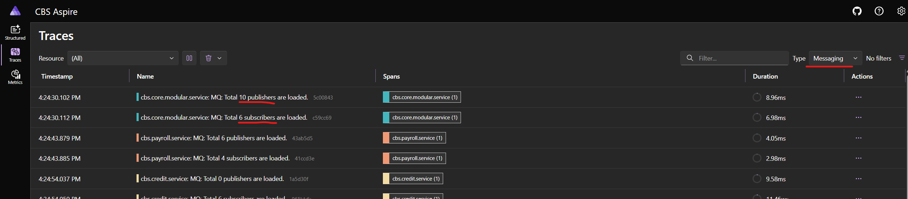
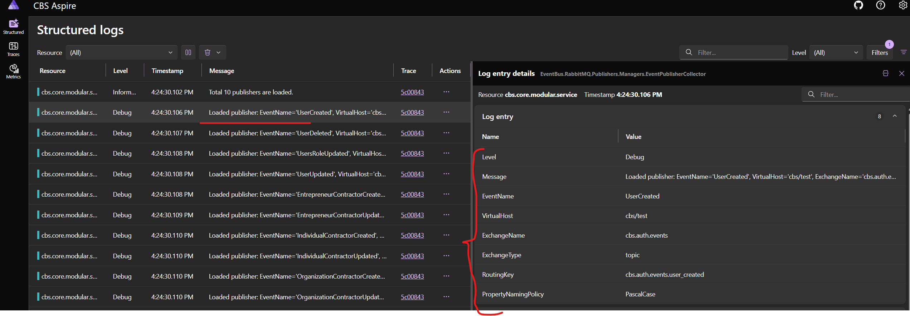
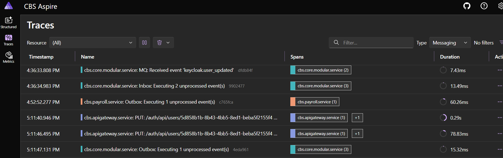
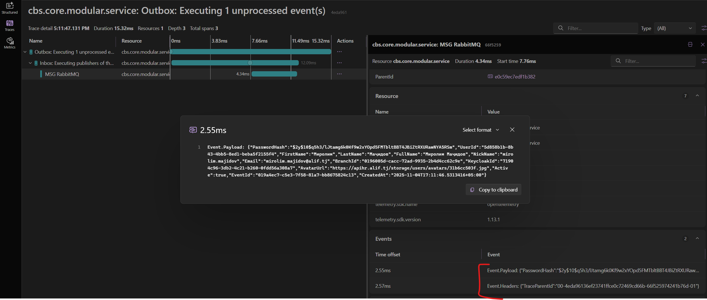

## EventBus.RabbitMQ
EventBus.RabbitMQ is a messaging library designed to simplify the implementation of communication using RabbitMQ. It enables seamless publishing and receiving of events between microservices or other types of applications. The library is easy to set up and is compatible with .NET8 or recent frameworks. Additionally, it supports working with multiple virtual hosts in RabbitMQ.

### Setting up the library

Make sure you have installed and run [PostgreSQL](https://www.postgresql.org/download/) in your machine.

To use this package from GitHub Packages in your projects, you need to authenticate using a **Personal Access Token (PAT)**.

#### Step 1: Create a Personal Access Token (PAT)

You need a GitHub [**Personal Access Token (PAT)**](https://docs.github.com/en/github/authenticating-to-github/creating-a-personal-access-token) to authenticate and pull packages from GitHub Packages. To create one:

1. Go to your GitHub account.
2. Navigate to **Settings > Developer settings > Personal access tokens > Tokens (classic)**.
3. Click on **Generate new token**.
4. Select the following scope: `read:packages` (for reading packages)
5. Generate the token and copy it. You'll need this token for authentication.

#### Step 2: Add GitHub Packages as a NuGet Source

You can choose one of two methods to add GitHub Packages as a source: either by adding the source dynamically via the `dotnet` CLI or using `NuGet.config`.

**Option 1:** Adding Source via `dotnet` CLI

Add the GitHub Package source with the token dynamically using the environment variable:

```bash
dotnet nuget add source https://nuget.pkg.github.com/alifcapital/index.json --name github --username GITHUB_USERNAME --password YOUR_PERSONAL_ACCESS_TOKEN --store-password-in-clear-text
```
* Replace GITHUB_USERNAME with your GitHub username or any non-empty string if you are using the Personal Access Token (PAT).
* Replace YOUR_PERSONAL_ACCESS_TOKEN with the generated PAT.

**Option 2**: Using `NuGet.config`
Add or update the `NuGet.config` file in your project root with the following content:

```xml
<?xml version="1.0" encoding="utf-8"?>
<configuration>
  <packageSources>
    <add key="github" value="https://nuget.pkg.github.com/alifcapital/index.json" />
  </packageSources>
  <packageSourceCredentials>
    <github>
      <add key="Username" value="GITHUB_USERNAME" />
      <add key="ClearTextPassword" value="YOUR_PERSONAL_ACCESS_TOKEN" />
    </github>
  </packageSourceCredentials>
</configuration>
```
* Replace GITHUB_USERNAME with your GitHub username or any non-empty string if you are using the Personal Access Token (PAT).
* Replace YOUR_PERSONAL_ACCESS_TOKEN with the generated PAT.

#### Step 3: Add the Package to Your Project
Once you deal with the nuget source, install the package by:

**Via CLI:**

```bash
dotnet add package AlifCapital.EventBus.RabbitMQ --version <VERSION>
```

Or add it to your .csproj file:

```xml
<PackageReference Include="AlifCapital.EventBus.RabbitMQ" Version="<VERSION>" />
```
Make sure to replace <VERSION> with the correct version of the package you want to install.

### How to use the library

Register the nuget package's necessary services to the services of DI in the Program.cs and pass the assemblies to find and load the publishers and subscribers automatically:

```
builder.Services.AddRabbitMQEventBus(builder.Configuration, assemblies: [typeof(Program).Assembly]);
```

### Create and publish an event massage

Start creating an event to publish. Your record must implement the `IPublishEvent` interface or inherit from the `PublishEvent` record. Example:

```
public record UserDeleted : PublishEvent
{
    public required Guid UserId { get; init; }
    
    public required string UserName { get; init; }
}
```

To publish your event, you must first inject the `IEventPublisherManager` interface from the DI and pass your event object to the `PublishAsync` method. Then, your event will be published.

```
public class UserController : ControllerBase
{
    private readonly IEventPublisherManager _eventPublisherManager;

    public UserController(IEventPublisherManager eventPublisherManager)
    {
        _eventPublisherManager = eventPublisherManager;
    }
    
    [HttpPost]
    public async Task<IActionResult> Create([FromBody] User item)
    {
        Items.Add(item.Id, item);

        var userCreated = new UserCreated { UserId = item.Id, UserName = item.Name };
        await _eventPublisherManager.PublishAsync(userCreated);
        
        return Ok(item);
    }
}
```

The `IEventPublisherManager` interface has two main methods to publish an event:
1. The `PublishAsync` method is used to publish event immediately to the RabbitMQ.
2. The `Collect` method is used to collect the event to the memory and then publish them while the scope/session/request is completed. It is useful if you want to collect multiple events and clear them if needed. You could use the `CleanCollectedEvents` method of the `IEventPublisherManager` to clear the collected events. By default, all collected events will be published automatically.


### Create a subscriber to the event

If you want to subscribe to necessary an event, first you need to create your own an event structure to subscribe. Your subscribe record must implement the `ISubscribeEvent` interface or inherit from the `SubscribeEvent` record. Example:

```
public record UserCreated : SubscribeEvent
{
    public required Guid UserId { get; init; }

    public required string UserName { get; init; }
}
```

Then you need to create an event subscriber to receive an event. Your event subscriber class must implement the `IEventSubscriber<>` interface and implement your subscriber event structure. Example:

```
public class UserCreatedSubscriber : IEventSubscriber<UserCreated>
{
    private readonly ILogger<UserCreatedSubscriber> _logger;

    public UserCreatedSubscriber(ILogger<UserCreatedSubscriber> logger)
    {
        _logger = logger;
    }

    public async Task HandleAsync(UserCreated @event)
    {
        _logger.LogInformation("EventId ({EventId}): '{UserName}' user is created with the {UserId} id", @event.EventId,
            @event.UserName, @event.UserId);

        await Task.CompletedTask;
    }
}
```

Depend on your business logic, you need to add your logic to the `HandleAsync` method of subscriber to do something based on your received event.

### Advanced configuration of publishers and subscribers from configuration file.

First you need to add a new section called `RabbitMQSettings` to your configuration file.

```
"RabbitMQSettings": {
    "DefaultSettings": {
      "IsEnabled": true,
      "HostName": "localhost",
      "HostPort": 5672,
      "VirtualHost": "users",
      "UserName": "admin",
      "Password": "admin123",
      "ExchangeName": "users_exchange",
      "ExchangeType": "topic",
      "QueueName": "users_queue",
      "RoutingKey": "users.created",
      "RetryConnectionCount": 5,
      "EventNamingPolicy": "SnakeCaseLower",
      "PropertyNamingPolicy": "CamelCase",
      "QueueArguments": {
        "x-queue-type": "quorum"
      },
      "ExchangeArguments": {
        "alternate-exchange": "your-alternate-exchange-name"
      }
    },
    "Publishers": {
      "UserDeleted": {
        "VirtualHostKey": "users_test",
        "RoutingKey": "users.deleted",
        "PropertyNamingPolicy": "KebabCaseLower"
      },
      "UserUpdated": {
        "RoutingKey": "users.updated",
        "EventTypeName": "UserUpdatedEvent"
      }
    },
    "Subscribers": {
      "PaymentCreated": {
        "VirtualHostKey": "users_test",
        "QueueName": "payments_queue_UserService",
        "RoutingKey": "payments.created"
      }
    },
    "VirtualHostSettings": {
      "users_test": {
        "ExchangeName": "payments_exchange",
        "VirtualHost": "users/test",
        "QueueArguments": {
          "x-queue-type": "classic",
          "max-length-bytes": 1048576
        }
      },
      "payments": {
        "ExchangeName": "payments_exchange",
        "VirtualHost": "payments",
        "EventNamingPolicy": "KebabCaseUpper",
        "ExchangeArguments": {
          "alternate-exchange": "your-alternate-exchange-name"
        }
      }
    }
  }
```

A section may have the following subsections: <br/>
`DefaultSettings` - to set the default configuration/settings for connecting to the RabbitMQ and publishing and receiving messages. If you don't pass them, it will use default settings of RabbitMQ. The default settings has optional parameter named `QueueArguments` to pass the arguments to the queue and `ExchangeArguments` to pass the arguments to the exchange. Another thing is that, by passing false to the `IsEnabled` option, we are able to just disable using RabbitMQ.<br/>
`Publishers` - set custom settings for the publishers if needed. If you don't pass them, it will use the virtual host settings based on the `VirtualHostKey` which configured in the `VirtualHostSettings` section; <br/>
`Subscribers` - set custom settings for the subscribers if needed. If you don't pass them, it will use the virtual host settings based on the `VirtualHostKey` which configured in the `VirtualHostSettings` section; <br/>
`VirtualHostSettings` - adding virtual host configuration by given a key to use them from the publishers and subscribers. If we just add a new virtual host and not set all parameters, the not assigned properties automatically get/inherit a value from the default settings. If we don't want to use the default settings, we need to just set empty to the property to avoid auto-set. Then we can use the registered a virtual host from any subscribers or publishers by passing a `VirtualHostKey` value. Note: In the each `VirtualHostSettings` item, we are able to overwrite each option of the `DefaultSettings` except the `IsEnabled` and `UseInbox` options if needed.<br/>

##### Can we use the TLS protocol while publishing events or subscribing to the events?
Yes, we can. For that we need to just enable the using the TLS protocol by adding the options below to the `DefaultSettings` if we want to use that in all events, or add them to the specific virtual host to use from the publishing or subscribing event:

```
"RabbitMQSettings": {
    "DefaultSettings": {
      //your settings
      "UseTls": true,
      "SslProtocolVersion": "Tls12",
      "ClientCertPath": "path/to/client-cert.pem",
      "ClientKeyPath": "path/to/client-key.pem",
    },
    "Publishers": {
      "UserUpdated": {
          //your settings
        "VirtualHostKey": "users_test",
      }
    },
    "Subscribers": {
      "UserDeleted": {
          //your settings
        "VirtualHostKey": "payments",
      }
    },
    "VirtualHostSettings": {
      "users_test": {
        "ExchangeName": "payments_exchange",
        "VirtualHost": "users/test",
        "UseTls": false,
        "QueueArguments": {
          "x-queue-type": "classic",
          "max-length-bytes": 1048576
        }
      },
      "payments": {
        "ExchangeName": "payments_exchange",
        "VirtualHost": "payments",
        "UseTls": true,
        "SslProtocolVersion": "Tls",
        "ClientCertPath": "path/to/client-cert.pem",
        "ClientKeyPath": "path/to/client-key.pem",
      }
    }
  }
```
By default, the `UseTls` option is set to `false`. If you want to use the TLS protocol, you need to set it to `true`. The `SslProtocolVersion` option is optional, and by default, it uses the `Tls` protocol, but when we run the application in the K8s, it requires to use the `Tls12` protocol. The `ClientCertPath` and `ClientKeyPath` options are required if you want to use the TLS protocol.

#### Customizing the event type of publishing/subscribing event:
While publishing or subscribing an event by default uses the Name of event Type/Structure and convert it to the selected EventNamingPolicy (By default it is PascalCase).  For example, if you add an event named `UserUpdated`, while publishing or subscribing/receiving that `UserUpdated` name as event type will be used. But if you want, you can overwrite the event type by specifying the EventNamingPolicy or added event type name to the config file:
```
"RabbitMQSettings": {
    "DefaultSettings": {
      //your settings
      "EventNamingPolicy": "SnakeCaseLower",
    },
    "Publishers": {
      "UserUpdated": {
        "VirtualHostKey": "users",
        "EventTypeName": "UserUpdatedEvent"
      }
    },
    "Subscribers": {
      "UserDeleted": {
        "VirtualHostKey": "users",
        "QueueName": "deleted_users_queue",
      }
    },
    "VirtualHostSettings": {
      "users": {
        "ExchangeName": "users_exchange",
        "QueueName": "users_queue",
        "EventNamingPolicy": "KebabCaseLower",
      }
    }
  }
```
Keep in mind, the `EventTypeName` and `EventNamingPolicy` options are optional, and if you don't pass it, it will use the event name automatically. But if you pass the `EventTypeName`, it will use that name as the event type name even if the `EventNamingPolicy` is set.

#### What if I want to subscribe to an event from another system that doesn't publish an event type?
When RabbitMQ receives an event from a `Consumer`, it tries to read the event type from the received event, if it can't find it, it uses the `routing key` instead to find the event subscriber.

### Changing a naming police for serializing and deserializing properties of Event

By default, while serializing and deserializing properties of event, it will use the `PascalCase`, but you can also use `CamelCase`, `SnakeCaseLower`, `SnakeCaseUpper`, `KebabCaseLower`, or `KebabCaseUpper` if you want. For this you need to add `PropertyNamingPolicy` option to `RabbitMQSettings` section if you want to apply it for all publishers or subscribers, or you can use/overwrite it from the specific a virtual host, or use/overwrite it from the publisher or subscriber event too. Example:
```
"RabbitMQSettings": {
    "DefaultSettings": {
      //your settings
      "PropertyNamingPolicy": "KebabCaseLower"
    },
    "Publishers": {
      "PaymentCreated": {
        //your settings
        "PropertyNamingPolicy": "SnakeCaseUpper"
      }
    },
    "Subscribers": {
      "UserDeleted": {
        //your settings
        "PropertyNamingPolicy": "CamelCase"
      }
    },
    "VirtualHostSettings": {
      "users": {
        "PropertyNamingPolicy": "KebabCaseUpper"
      }
    }
  }
```

### Advanced configuration of publishers and subscribers while registering to the DI services.

Since the library is designed to work with multiple a virtual hosts of RabbitMQ, there is a way to configure each publisher and subscriber separately from the configuration file or while registering to the DI services.
```
builder.Services.AddRabbitMQEventBus(builder.Configuration,
    assemblies: [typeof(Program).Assembly],
    defaultOptions: options =>
    {
        options.HostName = "localhost";
    },
    virtualHostSettingsOptions: settings =>
    {
        settings.Add("users_test", new RabbitMqHostSettings
        {
            HostName = "localhost",
            VirtualHost = "users/test",
            UserName = "admin",
            Password = "admin123",
            HostPort = 5672
        });
    },
    eventPublisherManagerOptions: publisherManager =>
    {
        publisherManager.AddPublisher<UserDeleted>(op => op.RoutingKey = "users.deleted");
        publisherManager.AddPublisher<UserUpdated>(op => op.RoutingKey = "users.updated");
    },
    eventSubscriberManagerOptions: subscriberManager =>
    {
        subscriberManager.AddSubscriber<PaymentCreated, PaymentCreatedHandler>(op =>
        {
             op.VirtualHostKey = "users_test";
        });
    }
);
```

`defaultOptions` - it is an alternative way of overwriting `DefaultSettings` settings, to set the default configuration/settings for connecting to the RabbitMQ and publishing and receiving messages. If you don't pass them, it will use default settings of RabbitMQ; <br/>
`virtualHostSettingsOptions` - it is an alternative way of overwriting `VirtualHostSettings` settings, to register and overwrite settings of specific virtual host to use that from the subscribers and publishers if needed; <br/>
`eventPublisherManagerOptions` - it is an alternative way of overwriting `Publishers` settings, to register and set custom settings for the publishers if needed. If you don't pass them, it will use the default settings configured in the `DefaultSettings` section or RabbitMQ's default settings; <br/>
`eventSubscriberManagerOptions` - it is an alternative way of overwriting `Subscribers` settings, to register and set custom settings for the subscribers if needed. If you don't pass them, it will use the default settings configured in the `DefaultSettings` section or RabbitMQ's default settings; <br/>
`assemblies` - as I mentioned in above, it is to find and load the publishers and subscribers and register them to the services of DI automatically. It can be multiple assemblies depend on your design.

### Adding property to the publishing event's headers

Before publishing an event, you can attach properties to the event's headers by passing the header name and value to the `AddHeader` method. Keep in mind, the header name must be unique, otherwise it will throw exception. Example:
```
var userUpdated = new UserUpdated { UserId = item.Id, OldUserName = item.Name, NewUserName = newName };
userUpdated.Headers = new();
userUpdated.Headers.Add("TraceId", HttpContext.TraceIdentifier);
await _eventPublisherManager.PublishAsync(userUpdated);
```

### Reading property from the subscribed event's headers

We can read the attached property value from the Headers collection of the received event. Example:
```
public async Task HandleAsync(UserCreated @event)
{
    if (@event.Headers?.TryGetValue("TraceId", out var traceId) == true)
    {
    }

    await Task.CompletedTask;
}
```

### Setting up the Inbox and Outbox patterns in this library

As mentioned earlier, implementing the Inbox and Outbox patterns with this library is easy. Currently, it supports storing event data only in a PostgreSQL database.

#### How to use the Outbox pattern in this library?
As you know, the Outbox pattern for storing all outgoing events or messages of application in a database. To use this functionality, first you need to enable the `Outbox` feature by adding the following section to your AppSettings file.
```
"InboxAndOutbox": {
    "Inbox": {
      //Your inbox settings
    },
    "Outbox": {
      "IsEnabled": true,
      "ConnectionString": "Connection string of the SQL database"
      //...
    }
  }
```
The `InboxAndOutbox` is the main section for setting of the Outbox and Inbox functionalities. The `Outbox` and `Inbox` subsections offer numerous options. For a detailed explanation on using these options, go to the [options of Inbox and Outbox sections](https://github.com/alifcapital/EventStorage?tab=readme-ov-file#options-of-inbox-and-outbox-sections) of the EventStorage documentation.

##### How to store an event in the Outbox pattern?

Your application is now ready to use this publisher. Inject the `IOutboxEventManager` interface from anywhere in your application, and use the `Collect` or `StoreAsync` methods to publish your `UserCreated` event.

```
public class UserController(IOutboxEventManager outboxEventManager) : ControllerBase
{
    [HttpPost]
    public async Task<IActionResult> Create([FromBody] User item)
    {
        Items.Add(item.Id, item);

        var userCreated = new UserCreated { UserId = item.Id, UserName = item.Name };
        var succussfullySent = await outboxEventManager.StoreAsync(userCreated, EventProviderType.MessageBroker);
        
        return Ok(item);
    }
}
```

The `IOutboxEventManager` interface has two main methods to publish an event:
1. The `StoreAsync` method is used to store the event in the database immediately. With this one, we could store single or multiple events at the same time.
2. The `Collect` method is used to collect the event to the memory and then store it in the database while the scope/session/request is completed. It is useful if you want to collect multiple events and clear them if needed. You could use the `CleanCollectedEvents` method of the `IOutboxEventManager` to clear the collected events.  By default, all collected events will be published automatically.

Both methods provide two forms of the method, one is with the event and the other are with the event and the event publisher type. When you store an event without the event publisher type, the library will automatically find all event providers that are suitable for the event type and publish the event to all of them. If you want to publish the event to a specific event provider, you need to pass the event provider type.

##### How to create an event publisher for the Outbox pattern?

By default, the current library has a `MessageBrokerEventPublisher` class that implements the `IMessageBrokerEventPublisher` interface, so you do not need to implement it. This class is used to publish all stored an outbox events to the RabbitMQ which configured as a MessageBroker provider.
But if you want to create event publisher for the event type for being able to use properties of event without casting, you need to just create event publisher by using generic interface of necessary publisher. In our use case is IMessageBrokerEventPublisher<UserCreated>.

```
public class CreatedUserMessageBrokerEventPublisher : IMessageBrokerEventPublisher<UserCreated>
{
    private readonly IEventPublisherManager _eventPublisher;

    public CreatedUserPublisher(IEventPublisherManager eventPublisher)
    {
        _eventPublisher = eventPublisher;
    }
    
    public async Task PublishAsync(UserCreated userCreated)
    {
        await _eventPublisher.PublishAsync(userCreated);
    }
}
```

Since we want to publish our an event to the RabbitMQ, the event publisher must implement the `IMessageBrokerEventPublisher` by passing the type of event we want to publish. And, inject the `IEventPublisherManager` interface to publish the publishing `UserCreated` event to the `RabbitMQ`.
When we use the `StoreAsync` method of the `IOutboxEventManager` interface to publish an event, the event is first stored in the database. Then, based on our configuration (_by default, after one second_), the event will then be automatically execute the `PublishAsync` method of created the `CreatedUserMessageBrokerEventPublisher` event publisher.

If an event fails for any reason, the server will automatically retry publishing it, with delays based on the configuration you set in the [Outbox section](https://github.com/alifcapital/EventStorage?tab=readme-ov-file#options-of-inbox-and-outbox-sections).

#### How to use the Inbox pattern in this library?

As you know, the Inbox pattern for storing all incoming events or messages to the application in a database. To use this functionality, first you need to enable the `Inbox` feature by adding the following section to your AppSettings file.
```
"InboxAndOutbox": {
    "Inbox": {
      "IsEnabled": true,
      "ConnectionString": "Connection string of the SQL database"
      //...
    },
    "Outbox": {
      //Your inbox settings
    }
  }
```

And then, set `true` to the `UseInbox` option of the `RabbitMQSettings.DefaultSettings`. Because by default it is disabled.

```
"RabbitMQSettings": {
    "DefaultSettings": {
        "UseInbox": true
        //your settings
    },
    "Publishers": {
        //your Publishers
    },
    "Subscribers": {
        //your Subscribers
    },
    "VirtualHostSettings": {
        //your a virtual hosts settings
    }
  }
```

That's all. Now all incoming events from RabbitMQ are stored in the `Inbox` table of the database and then execute the `HandleAsync` method of your event subscriber. See the [document of creating event subscriber](https://github.com/alifcapital/EventBus.RabbitMQ?tab=readme-ov-file#create-a-subscriber-to-the-event).

#### Advanced configuration of the Inbox and Outbox functionalities while registering to the DI services.

Since the library is designed to  from multiple places, there is a way to configure the `Inbox` and `Outbox` functionalities from the configuration file or while registering to the DI services.
```
builder.Services.AddRabbitMQEventBus(builder.Configuration,
    assemblies: [typeof(Program).Assembly],
    defaultOptions: options =>
    {
        //Your settings
    },
    virtualHostSettingsOptions: settings =>
    {
        //Your settings
    },
    eventPublisherManagerOptions: publisherManager =>
    {
        //Your settings
    },
    eventSubscriberManagerOptions: subscriberManager =>
    {
        //Your settings
    },
    eventStoreOptions: options =>
    {
        options.Inbox.IsEnabled = true;
        options.Inbox.TableName = "ReceivedEvents";
        options.Outbox.IsEnabled = true;
        options.Outbox.TableName = "SentEvents";
    }
);
```
`eventStoreOptions` - it is an alternative way of overwriting configurations of the `Inbox` and `Outbox` functionalities. If you don't pass them, it will use default settings from the `AppSettings`. About other configurations, you can get information from [here](https://github.com/alifcapital/EventBus.RabbitMQ?tab=readme-ov-file#advanced-configuration-of-publishers-and-subscribers-while-registering-to-the-di-services).

### Can we create multiple event publishers for the same event type?
No, we can't. If we try to create multiple event publishers for the same event type, it will throw an exception. The library is designed to work with a single event publisher for each event type.

### Can we create multiple event subscribers for the same event type?
Yes, we can. The library is designed to work with multiple event subscribers for the same event type, even if there are multiple event types with the same name, we support them. So, when event received, all event subscribers of event will be executed.


### Is there any way to investigate publishing and receiving RabbitMQ or EventStorage events process?
Yes, we can investigate all processes of `RabbitMQ` events and `EventStorage` by enabling `logging` or the `open telemetry` in our application.
The library uses the standard logging and open telemetry mechanism of .NET, so we can use them to investigate purposes.
Make sure you set the logging level to `Information` or `Debug` to see detailed logs related to processing event. If the log level is `Debug`,
it will show all configuration settings of each publisher and subscriber of RabbitMQ events while starting the application once.

#### How can we enable logging in the local machine/computer?
1. When you enable logging in your application, by default only the `Information` and above log level will show. To show more detailed logs, you need to set the log level to `Debug` in you `appsettings.json` file.
Example:
```json
{
   "Logging": {
      "LogLevel": {
         "Default": "Debug"
      }
   }
}
```
The `Logging` section is used to set the minimum log level for the application, to show logs in the `OpenTelemetry`'s logs tab.

2. Configure and run the `Aspire` application in your local machine and link your application, for being able to see the detailed `OpenTelemetry` logs from the Aspire. Even you are not using the `Aspire`, all logs will be shown in the console.

#### How to investigate processing events from the Aspire?
1. In the first, when the applications are started, each service will load all configurations of the `RabbitMQ` publishers and subscribers from the configuration file. And show them in the `OpenTelemetry`'s traces logs tab.
   
   When you open on of the trace of the necessary service, and go to the `View structured logs` tab, you could see all loaded events' configurations.
   
2. When an event is published or received, all kind of actions will be logged in the `OpenTelemetry`'s traces logs tab. You need to just filter the traces by `Messaging` type to see all related traces of publishing and receiving events.
   
   You could find more detailed information about each published or received event including the event payload by opening the necessary trace.
   